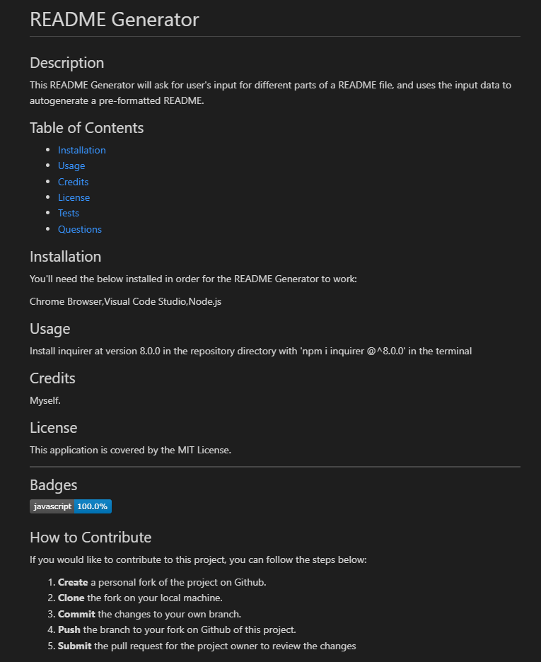

# readme-generator-shannon

## Description

As a review of the materials we learnt in our eleventh week, our **Week 11 Challenge** will test our skills in JavaScript ES6 & Node.js by having us create a README Generator.

In this web application, I have applied the following skills:

>00. ES6 Javascript
>01. JavaScript
>02. Node.js
>03. Google-fu
>04. Google-fu
>05. Lots of tears
>06. Google-fu
>07. Googling Youtube
>08. Google-fu

## Installation

You'll need the below installed in order for the README Generator to work:

Chrome Browser, Visual Code Studio, Node.js

## Usage 

Install inquirer at version 8.0.0 in the repository directory with 'npm i inquirer @^8.0.0' in the terminal

Run the following command:

'node index.js'

Screenshot of deployed website:

## Credits

Philip Howley (Instructor) 
Nic Catania (TA) 
Pod-4 mates 
Myself

## License

## Badges

